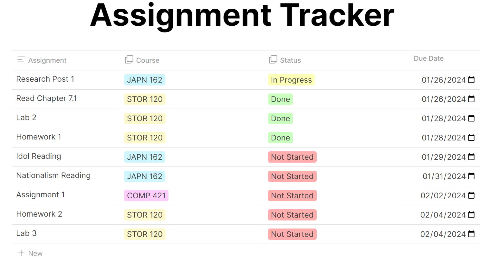

# Taskify

This web application helps students track their assignments and due dates and was created in React with a Firebase database.

## Login and Registration

This project has very simple login and registration and requires a unique username. It has form validation to ensure no two users have the same username.

## Assignment Dashboard

This assignment dashboard has a table view of all of the student's assignments. It can be sorted ascending or descending for each column.

